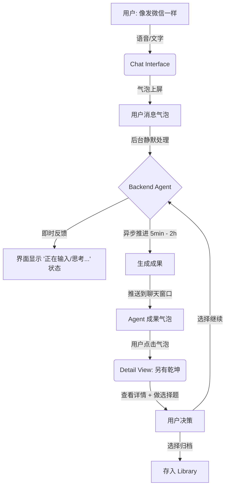

# Mind Shot 产品需求文档 (PRD)

## 1. 产品定义

Mind Shot 是一款伪装成聊天软件的异步思维推进器。

它看起来像是一个简单的聊天窗口（类似微信"文件传输助手"）。你只需要像给朋友发微信一样，把脑子里的杂念、灵感、任务丢进去。

屏幕对面的 Agent 会充当你的**"异步管家"**。它不会秒回废话，而是会默默在后台处理，等有实质性成果时，再发回一条消息告诉你："搞定了，去看看？"

## 2. 核心价值主张

### 2.1. 零认知负担 (Zero Friction)

- **痛点**：任何新的交互形式（看板、时间轴、卡片流）都有学习成本
- **解法**：Chat UI (聊天界面)。只要会用微信就会用 Mind Shot。底部输入框、语音按住说话、历史消息上滑回顾——一切都是肌肉记忆

### 2.2. 异步回响 (Async Echo)

- **痛点**：普通聊天机器人（如 ChatGPT）是同步的，你必须盯着它等字蹦完
- **解法**：Async Messaging (异步消息)。发完你就走。Agent 可能在 10 分钟或 2 小时后才回复你一条消息——但这不仅不打扰，反而让你惊喜，因为它利用这段时间做了深度的调研和整理

### 2.3. 另有乾坤 (Depth behind Bubble)

- **痛点**：聊天窗口不适合展示复杂内容（如长文档、表格）
- **解法**：Rich Bubble (富气泡)。Agent 回复的消息看起来很轻（如"已生成 LBS 游戏方案"），但点击气泡会展开一个全功能的详情页 (Detail View)，里面才是结构化的知识资产

## 3. 核心场景 (Use Cases)

### 3.1. 场景一：突发杂务

| 维度 | 内容 |
|------|------|
| **用户发送** | 语音："下周三提醒我给车做保养，顺便看看哪家机油好。" |
| **Agent 后台动作** | 1. 识别时间 2. 搜索机油 |
| **聊天窗口内的反馈** | 📅 日程已备好 附：机油性价比简报 |
| **点击气泡后的详情页** | 1. [添加到系统日历] 按钮 2. 机油对比表格 3. 选项：[加入购物清单] [归档] |

### 3.2. 场景二：灵感闪现

| 维度 | 内容 |
|------|------|
| **用户发送** | 文字："想做一个基于 Cursor 的代码上下文压缩工具。" |
| **Agent 后台动作** | 1. 搜竞品 2. 起草 MVP |
| **聊天窗口内的反馈** | "关于代码压缩工具，我整理了一份竞品分析与MVP建议，有3个关键差异点。" |
| **点击气泡后的详情页** | 1. Markdown 格式的项目书 2. 核心功能 Checklist 3. 选项：[转化为待办] [继续完善] |

### 3.3. 场景三：低优阅读

| 维度 | 内容 |
|------|------|
| **用户发送** | 丢入链接："这篇文章挺好，以后有空看。" |
| **Agent 后台动作** | 1. 抓取全文 2. 总结 |
| **聊天窗口内的反馈** | 📄 文章已归档 一句话毒舌总结：作者认为... |
| **点击气泡后的详情页** | 1. 核心观点列表 2. 原文链接 3. 关联的知识库条目 |

## 4. 产品功能设计

### 4.1. The Chat (核心交互界面)

**设计原则**：复刻微信/IM 的熟悉感，但去除噪音。

**底部输入栏**：
- 左侧：语音按钮（按住说话，松开即发）
- 中间：文本输入框
- 右侧：+ 号（发图片/文件）

**消息流 (The Stream)**：
- **用户侧**：绿色的气泡（代表 Input）
- **Agent 侧**：
  - **Receipt (回执)**：极简的灰色小字（如 "Agent 正在研究..."），处理完即消失，不留垃圾消息
  - **Result Bubble (成果气泡)**：白色的卡片或气泡。这是唯一会永久留在聊天记录里的 Agent 消息。它代表一个**"可交互的成果"**

### 4.2. Detail View (详情与决策)

**交互**：点击 Chat 中的 Agent 气泡 → 右侧滑出或底部弹起详情页。

**内容**：
- **结构化展示**：根据内容类型渲染（日历是时间视图，Idea 是文档视图）
- **Agent Propose (做选择题)**：页面底部固定展示 Agent 提出的 2-3 个后续选项
- **Edit Mode**：用户可以手动修改 Agent 生成的内容（Markdown 编辑）

### 4.3. Library (聊天记录的沉淀)

- **定位**：Chat 是"流"，Library 是"库"
- **逻辑**：所有在 Chat 中交互完成（归档）的卡片，都会自动分门别类存入 Library
- **功能**：提供搜索和文件夹视图，方便回头查找很久以前聊过的某个 Idea

### 4.4. Push Notifications (召回)

- **逻辑**：当 Agent 在后台耗时较长（如深度调研）完成后，如果用户不在 App 内，发送一条系统推送
- **文案**：模拟好友发消息的口吻
  - 例："Hey，关于那个 LBS 游戏，我有些新发现..."

## 5. 交互流程图 (The Chat Loop)

## 6. 总结

Mind Shot 的核心在于**"伪装"**。

它伪装成一个最简单的聊天工具，消除了所有的学习成本和心理压力。但在聊天窗口之下，它隐藏了一个强大的异步工作流引擎。用户感觉到的是"我在跟一个靠谱的朋友聊天"，而系统实际交付的是"结构化的知识资产"。
